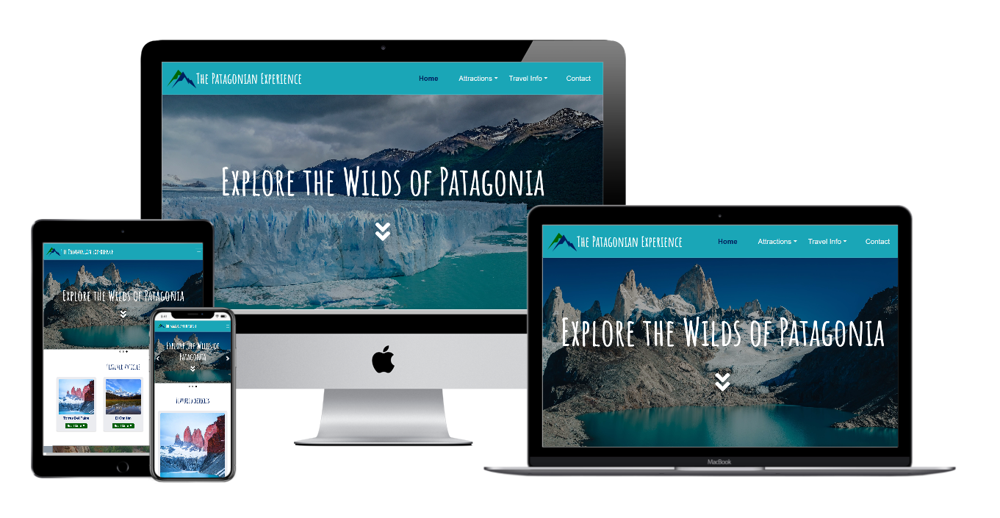
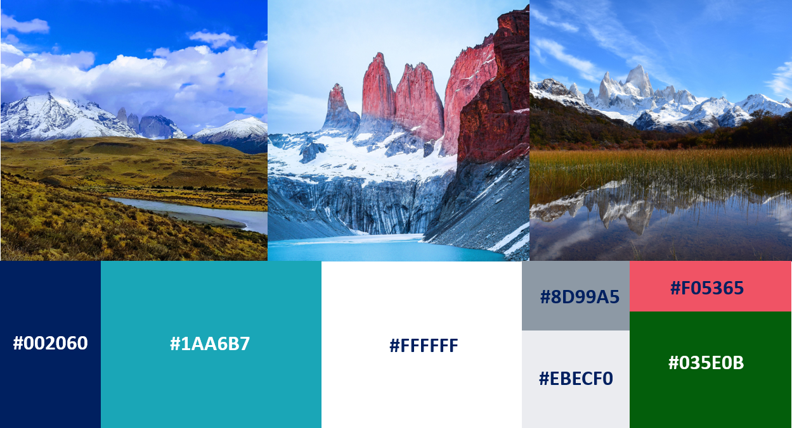
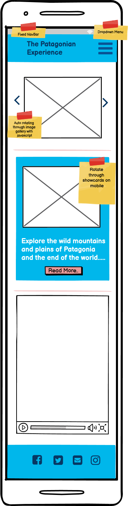
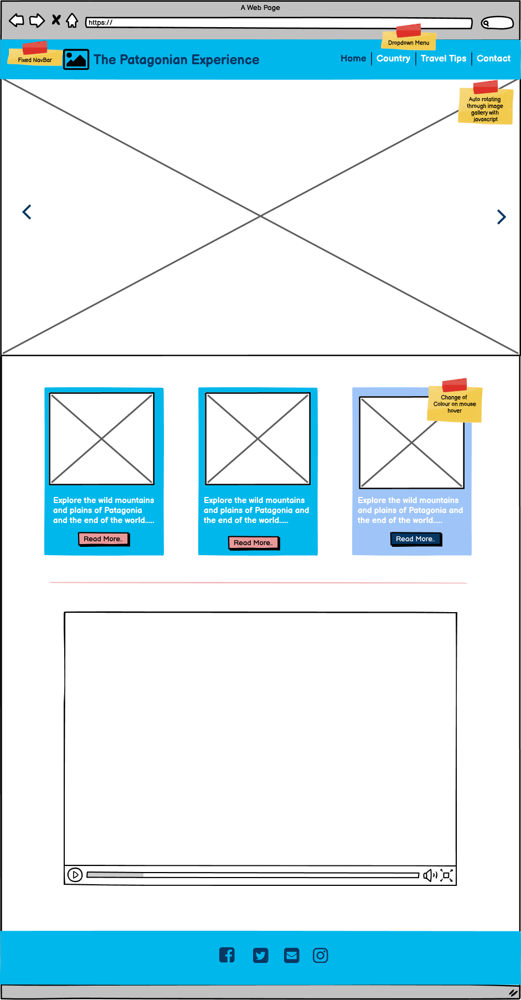
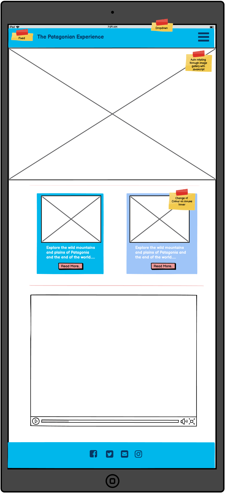
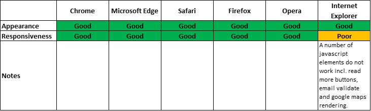

# The Patagonian Experience

### Code Institute - Milestone Project Two: Interactive Frontend Development

For my project I decided to build a travel website for Patagonia, I travelled there a few years ago and thought the incredible scenery would lend itself well to creating a visually impressive website.

The live website can be accessed [here](https://allanahmurphy.github.io/Milestone-Project-2/index.html).
 
## UX

#### Project Objective
The project objevtive was to create an interactive website to provide users with travel advice for Patagonia. The website was intended to showcase the amazing scenery of Patagonia, inticing the user to visit. 

#### User Stories
I created a number of user stories to help inform the requirements of the website, as detailed below. 

* As a user, I want to know more about Patagonia and its main attractions.
* As a user, I want to be able to contact the admin of the website to be able to ask for more information.
* As a user, I want to be able to locate the recommended hotels and restaurants. 
* As a user, I want to how to travel to Patagonia.
* As a user, I want to see strong images and scenery of the places I am thinking about visiting.
* As a user, I want to when is the best time to visit Patagonia.
* As a user, I want to know what I should pack for my trip. 
* As a user, I want information on the weather I can expect in Patagonia.

#### Design Choices

I wanted the website to look clean but also enticing and to showcase the best of Patagonia's scenery. To achieve this I used images from Patagonia to guide the colour choice, pullign out the blues of the glacial lakes and greens of the scenery with a pink and navy used for calls to action and for stronger emphasis.

In terms of the overall design, I wanted the website to feel modern but not overally stylised or minimalistic. I wanted something easily accessible and readable with obvious calls to action. The initial wireframe for the home page is shown below and while the design evolved during detailed design I think it still gives a strong sense of the final website. 

All wireframes created for the project can be found [here](https://github.com/allanahmurphy/Milestone-Project-2/tree/master/wireframes). The wireframes were created using [Balsamiq](https://balsamiq.com/).  

## Features

### Existing Features

#### Header, Navbar and Footer

Every page shares the same header, navbar and footer with the active tab changed to reflect the current page. Below outlines the features included in the header and navbar.

- webpage logo and name linking back to home page;
- Active page highlighted in navbar;
- Dropdown menu for subsection of attractions and travel info page;
- Accent colour on hovering over nav items;
- Collapsed hamburger navbar on smaller devices. 

Within the footer the following is included.

- Social media icons and links. 

#### index.html

Within the home page the following features are included (as well as the above):

- Rotating Hero image created with [flexslider](http://flexslider.woothemes.com/);
- 3 showcards with a read more option and a link to attractions page. Showcards change colour on hover;
- Embedded youtube video of Expedia Patagonian Travel guide, this plays onload but on mute. 

#### Attractions

##### torresDelPaine.html, elChalten.html, ushuaia.html, peritoMoreno.html

- Hero image of scenery at attractions.
- Overview of attraction with a read more option. 
- 5 day weather forecast at attractions using data from the openweathermap api.
- Google map api of the local area around attraction with nearby restaurants added onload. Locations of  and data for restaurants and hotels retrieved using tripadvisor api.
- Dropdown menu to update map to add restaurants or hotels.
- Popup window on map markers which provide the name, trip advisor rating and link to trip advisor web page for restaurant or hotel. 

#### travelInfo.html

- Overview of best way to travel to Patagonia.
- Data from skyscanner api with dates, prices and airline for next flights to Patagonia.
- Overview of what to pack with collapsable menu of different categories.
- Overview of when to go (weather is a very important consideration when visiting Patagonia!)/ 
- Overview of 5 day weather forecast for el Calafate, one of the main towns on the Argentinian side. 

#### contact.html

- form to send email query with required fields.
- alerts on sending or if field not correctly filled out.
- No numbers or words less than 2 letters in name, email validation and minimum of 5 letter in message. 

### Future Features

- I would like to add a overview of monthly weather for the year in the when to go section but this was only available with the paid version of the open weather api.
- Ability to search flight between any two locations live on the website. 
- Additional attractions. 
- Check hotel availability on maps.

## Technologies Used

### Languages Used

* [HTML5](https://en.wikipedia.org/wiki/HTML5)
* [CSS3](https://en.wikipedia.org/wiki/Cascading_Style_Sheets)
* [JavaScript](https://www.javascript.com/) 

### Frameworks, Libraries and Programs Used

- [Bootstrap v4.5.0](https://getbootstrap.com/) - Used for the responsove layout as well as custom components such as forms, modal popups, navigation bar, footer, cards and collapsable element.
- [jquery](https://jquery.com/) - Used in some of the clickable elements such as collapsable 'hamburger' nav bar.
- [popper.js](https://popper.js.org/) - Used in some of the clickable elements such as collapsable 'hamburger' nav bar.
- [flexslider](http://flexslider.woothemes.com/) -  Used for hero image slider on home page.
- [Email](https://www.emailjs.com/) - Used to send email form.
- [RapidApi](https://rapidapi.com/) - Used to gain access to [TripAdvisorAPI](https://rapidapi.com/apidojo/api/tripadvisor1), [SkyScannerAPI](https://rapidapi.com/skyscanner/api/skyscanner-flight-search)
- [OpenWeatherMapAPI](https://openweathermap.org/api) -  Used to get data for 5-day weather forecasts.
- [GoogleMapJavascriptApi](https://developers.google.com/maps/documentation/javascript/overview) - Used to render google maps to display Trip Advisor data. 
- [Font Awesome](https://fontawesome.com/) - Font Awesome was used to add icons to hero image and social media icons.
- [Google Fonts](https://fonts.google.com/) - Google Fonts was used to import 'Roboto' and 'Amatic SC' fonts in the style.css stylesheet.
- [Git](https://git-scm.com/) - Git was used to allow for tracking of any changes in the code and for the version control.
- [GitPod](https://www.gitpod.io/) - GitPod, conected to GitHub, hosted the coding space and allowed the projected to be commited to the Github repository.
- [Github](https://github.com/) - GitHub is used to host the repository and publish the live website by using Git Pages.
- [Google Chrome developer tools](https://developers.google.com/web/tools/chrome-devtools) for testing and troubleshooting.
- [W3C Markup Validation](https://validator.w3.org/) used to validate HTML.
- [W3C CSS validation](https://jigsaw.w3.org/css-validator/) used to validate CSS.
- [Tiny jpg](https://tinyjpg.com/) - Used to reduce image size.
- [ResizeImage](https://resizeimage.net/) -  Used to Further reduce images.

## Testing

#### Code Validation

Each page was ran through the W3C HTML validator, the stylesheet through the CSS validator and the javascript files through JS hint. The following errors were flagged and corrected:

- Images missing alt attribute;
- Frameborder obselete for iframe;
- type for javascript sources not required;
- Missing semicolons and unnesscessary semicolons in JS files;

There was additional warnings for the JavaScript files which highlighted undefined functions and variables, however these are defined in external JS libraries read in prior to the project JS files. There was also some warnings in relation to Internet Explorer compatibility which could not be addressed.

#### Browser Compatibility

The live website, hosted on gitpages, has been opened and tested on multiple browsers for responsives and intended appearance. Browers tested included:

* Google Chrome
* Safari
* Microsoft Edge
* Internet Explorer
* Firefox
* Opera

Overall the website worked well and appeared as intended on different sizes across different browsers. However, there were a number of javascript functions which were not supported on IE. 

#### Responsiveness

The website has been tested across multiple screen sizes using [Google Chrome developer tools](https://developers.google.com/web/tools/chrome-devtools) for a range of screen sizes, portrait and landscape, including:

- Moto G4
- Galaxy S5
- Pixel 2
- Pixel 2 XL
- iPhone 5 SE
- iPhone 6/7/8
- iPhone 6/7/8 Plus
- iPhone X
- iPad
- iPad Pro

The screen was also adjusted through various sizes and breakpoints with the responsive option in developer tools. The website was also opened and checked on Samsung A20 & iPhone SE mobile devices as well as Dell xps 15, Lenovo Think Pad and Apple Macbook. The responsiveness was also tested on the browsers outlined above with no noted issues. Overall the website appeared as intended across each screen type. There were some intial errors particularly on iPhone5 screen size (320px width) with overflows of titles. However, an additional media query was added to address this and all screens less than 400px approximately. 

### User experience & Usability

Multiple users of different ages (friends, family members) were asked to open the devices on mobiles and laptop to sense check the layout, readability and usability of the site. Comments back included the below:

- Request to change heading/text sizes slightly;
- Update to some images.

A thorough review was also done across all pages and links to ensure they were mapped correctly and no unexpected errors were thrown up. 

### Overflow

[Unicorn Revealer](https://chrome.google.com/webstore/detail/unicorn-revealer/lmlkphhdlngaicolpmaakfmhplagoaln/related) was also used to test all pages for overflows with none found. 

### Performance Testing

Chrome developer tools was used to undertake a performance audit of each page. Initially there were significant performance issues due to the size of the image files. There were reduced and resized using [Tiny jpg](https://tinyjpg.com/) and [ResizeImage](https://resizeimage.net/). This significantly improved the load time of the pages. 

### Email Test

A number of email were sent from the website to check it was linking correctly to the emai given to EmailJS. It worked as demonstrated below. 

### Known issues

I've fixed the header to the top of the screen as I think this makes website easier to navigate. I dropped the content below this so there is no content blocked. However, when navigating to one of the in page anchors within the Travel Info page the header blocks the heading. I've tried various fixes for this with no success. I've still left the navbar fixed as I believe the benefit of it outweighs the minor error. 

## Deployment

There is  one branch of this project (master) and the [deployed version](https://allanahmurphy.github.io/Milestone-Project-2/index.html) of this site is the most current.

### Deployment Steps
To deploy this page to GitHub Pages from its repository, the following steps were taken:

1. From the menu items near the top of the repository page, select settings;
2. Scroll down to the GitHub Pages section;
3. Under source click the drop-down menu labelled None and select Master Branch;
4. On selecting Master Branch the page will be automatically refreshed and the website is now deployed;
5. Return to the GitHub Pages section in settings to retrieve the link to the deployed website. It may take a short time for the deloyment to go live. 

### Cloning Locally
To clone this project from GitHub:

1. Under the repository name, click Clone or download;
2. In the Clone with HTTPs section, copy the clone URL for the repository;
3. In your local IDE open Git Bash;
4. Change your current working directory to the location where you want the cloned directory to be made;
5. Type git clone, and then paste the URL you copied from the https section of the repository;
6. Press Enter to create your local clone.

More information on cloning from github can be found [here](https://help.github.com/en/github/creating-cloning-and-archiving-repositories/cloning-a-repository).

## Credits

#### Code

Code was taken directly or adapted from the following sources and adjusted to fit the website:

* [Bootstrap Collapse Navbar](https://getbootstrap.com/docs/4.1/components/navbar/);
* [Bootstrap Modal Popups](https://getbootstrap.com/docs/4.1/components/modal/);
* [Bootstrap Forms](https://getbootstrap.com/docs/4.1/components/forms/);
* [Horizontal Rule with fade styling](https://codepen.io/ibrahimjabbari/pen/ozinB**/);
* [Google Maps API](https://developers.google.com/maps/documentation/javascript/overview);
* [Read More button Tutorial](https://www.youtube.com/watch?v=uI18xGocVnw);
* [Open Weather Api Examples](https://openweathermap.org/api/one-call-api#list) & [here](https://bithacker.dev/fetch-weather-openweathermap-api-javascript);
* [Email Validation](https://www.tutorialspoint.com/javascript/javascript_form_validations.htm);
* [Multiple Onload Code](https://www.htmlgoodies.com/beyond/javascript/article.php/3724571/using-multiple-javascript-onload-functions.htm);

Copied or adpated code is also referenced within the HTML, CSS and JS file comments.

#### Content
The content was taken from a variety of sources as outlined below. 

* Attractions
    - Torres Del Paine - [Lonely Planet](https://www.lonelyplanet.com/chile/southern-patagonia/parque-nacional-torres-del-paine)
    - El Chalten - [Lonely Planet](https://www.lonelyplanet.com/argentina/patagonia/el-chalten)
    - Ushuaia - [Lonely Planet](https://www.lonelyplanet.com/argentina/tierra-del-fuego/ushuaia)
    - Perito Moreno - [Lonely Planet](https://www.lonelyplanet.com/argentina/patagonia/parque-nacional-los-glaciares-south)

* Travel Info
    - How to get there - [Worldly Adventurer](https://www.worldlyadventurer.com/how-to-get-to-patagonia/)
    - What to pack - [Quasarex](https://www.quasarex.com/patagonia/packing-list)
    - When to Go - [US News](https://travel.usnews.com/Chilean_Patagonia_Argentina/When_To_Visit/)

Again these references are also outlined in the code comments. 

### Media

The following is all images used on the website and the source.

* The Hero images
    - Torres Del Paine - Developer's own image,
    - Perito Merono Glaciar - Image by [John Weinhardt](https://unsplash.com/@hansjuergen),
    - Mount Fitzroy El Chalten - Image by [Arto Marttinen](https://unsplash.com/@wandervisions),
* Showcards
    - Torres del Paine Sunset - Image by [Samuel Chenard](https://unsplash.com/@samuelchenard),
    - Mount FitzRoy with lake - Image by [Lia Tzanidaki](https://unsplash.com/@liatza),
    - Town of Ushuaia - Image by [66 north](https://unsplash.com/@66north),
* Attractions
    - Grey Glaciar (Torres Del Paine) - Developer's own image, 
    - Mount FitzRoy with Highway - Photo by [Bruno De Regge](https://unsplash.com/s/photos/el-chalten?utm_source=unsplash&amp;utm_medium=referral&amp;utm_content=creditCopyText),
    - Perito Moreno - Photo by [Mike Swigunski](https://unsplash.com/s/photos/perito-moreno?utm_source=unsplash&amp;utm_medium=referral&amp;utm_content=creditCopyText),
    - Ushuaia at Sunset - Image by [Andres Zorko](https://pixabay.com/?utm_source=link-attribution&amp;utm_medium=referral&amp;utm_campaign=image&amp;utm_content=4073637),

### Acknowledgements

I'd like to thank my mentor, Precious Ijege, for his time, advice and patience on this project. I should also thank various friends and family member who took time to review and provide feedback as well as the Code Institute Peer Review Slack Channel. 

